<!-- Find and Replace All [repo_name] -->
<!-- Replace [product-screenshot] [product-url] -->
<!-- Other Badgets https://naereen.github.io/badges/ -->

[![Contributors][contributors-shield]][contributors-url]
[![Forks][forks-shield]][forks-url]
[![Stargazers][stars-shield]][stars-url]

# JointSavings_smart_contract

To automate the creation of joint savings accounts, it was created a Solidity smart contract that accepts two user addresses. These addresses are able to control a joint savings account. The smart contract uses ether management functions to implement a financial institution’s requirements for providing the features of the joint savings account. These features consists of the ability to deposit and withdraw funds from the account.

---

## Technologies

This project leverages the following tools for financial analysis:

- [Solidity](https://docs.soliditylang.org/en/v0.8.13/) - programming language for implementing smart contracts.

- [Remix IDE](https://remix.ethereum.org) - Remix IDE allows developing, deploying and administering smart contracts for Ethereum like blockchains.

Solidity version:

```
pragma solidity ^0.5.0
```

---

## How to run

1. Go to Remix IDE (pls, find the link above) and open smart contract from the repository

2. Compile smart contract

3. Choose `JavaScript VM` environment and deploy smart contract

4. Interact with the contract

---

## Example of running

### Deployed contract

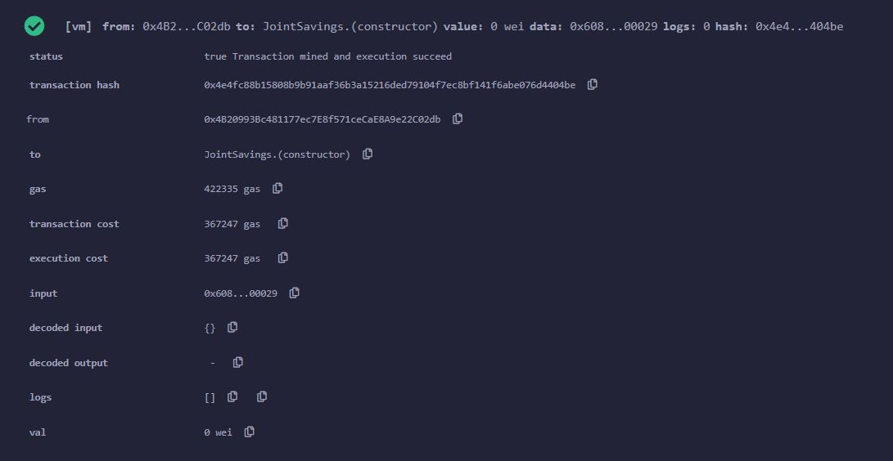

### Use the `setAccounts` function to define the authorized Ethereum address that will be able to withdraw funds from your contract.

```
Dummy account1 address: 0x0c0669Cd5e60a6F4b8ce437E4a4A007093D368Cb
Dummy account2 address: 0x7A1f3dFAa0a4a19844B606CD6e91d693083B12c0
```

Here is the result of setting up the accounts:

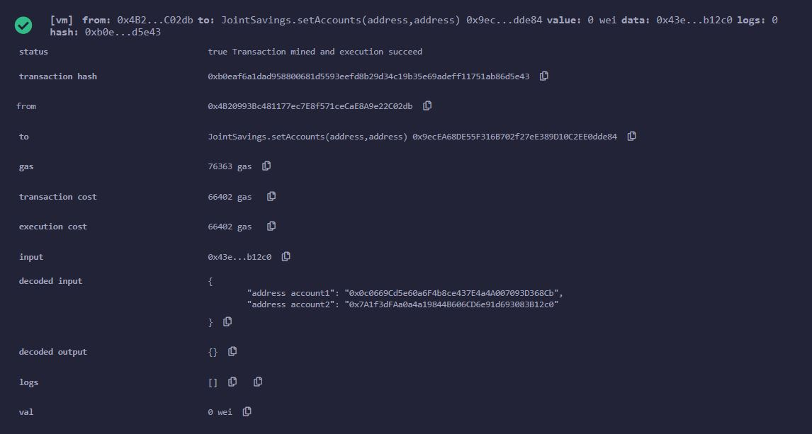

### Test the deposit functionality of your smart contract by sending the following amounts of ether. After each transaction, use the `contractBalance` function to verify that the funds were added to your contract:

Transaction 1: Send 1 ether as wei.

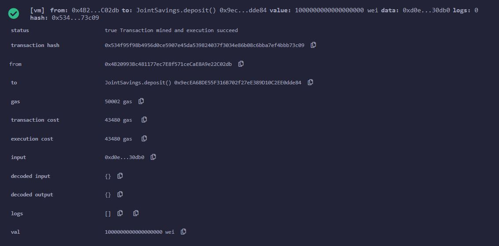

New contract balance:

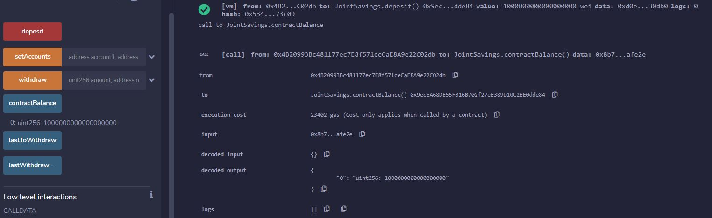

Transaction 2: Send 5 ether as wei.

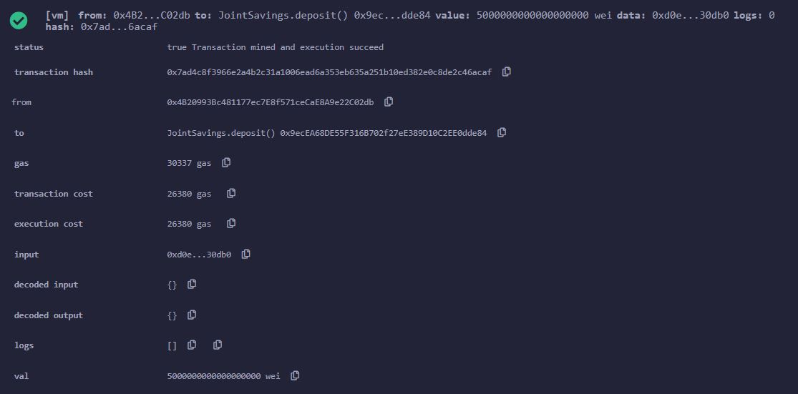

New contract balance:

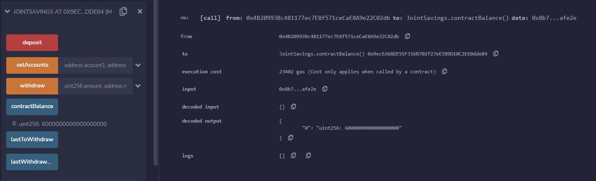

Transaction 3: Send 10 ether.

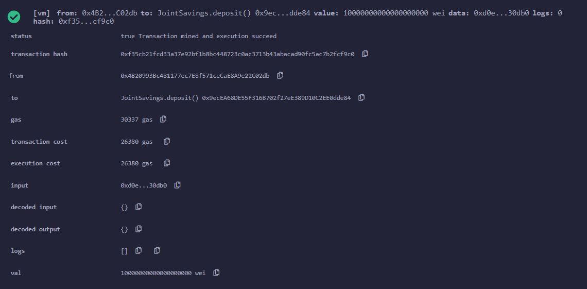

New contract balance:

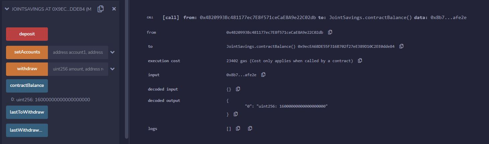

### Test the contract’s withdrawal functionality by withdrawing 5 ether into `accountOne` and 10 ether into `accountTwo`.

Withdrawing 5 ether into `accountOne`:

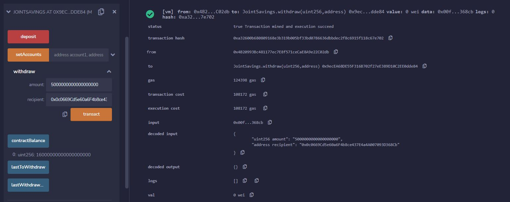

Last Withdrawing account and amount:

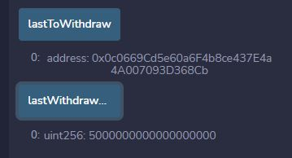

Withdrawing 10 ether into `accountTwo`, last Withdrawing account and amount and contract balance:

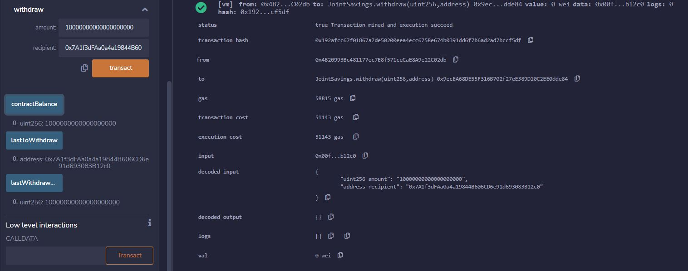

You can see that contract balance became 1 Ether.

---

## Contributors

Glupak Vladislav [Linkedin](https://www.linkedin.com/in/vladislav-glupak/)

<!-- MARKDOWN LINKS & IMAGES -->
<!-- https://www.markdownguide.org/basic-syntax/#reference-style-links -->

[contributors-shield]: https://img.shields.io/github/contributors/VladislavGlupak/Blockchain-based-ledger-system.svg?style=for-the-badge
[contributors-url]: https://github.com/VladislavGlupak/Blockchain-based-ledger-system/graphs/contributors
[forks-shield]: https://img.shields.io/github/forks/VladislavGlupak/Blockchain-based-ledger-system.svg?style=for-the-badge
[forks-url]: https://github.com/VladislavGlupak/Blockchain-based-ledger-system/network/members
[stars-shield]: https://img.shields.io/github/stars/VladislavGlupakBlockchain-based-ledger-system.svg?style=for-the-badge
[stars-url]: https://github.com/VladislavGlupak/Blockchain-based-ledger-system/stargazers
[issues-shield]: https://img.shields.io/github/issues/VladislavGlupak/Blockchain-based-ledger-system/network/members?style=for-the-badge
[issues-url]: https://github.com/VladislavGlupak/Blockchain-based-ledger-system/issues

## License

[](https://opensource.org/licenses/MIT)
